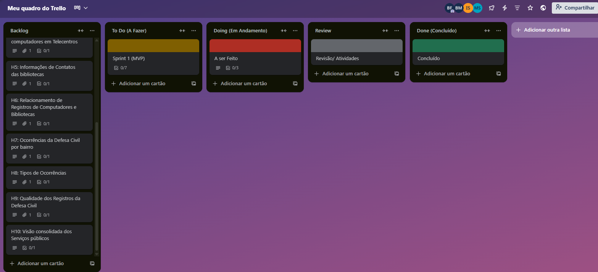

# 📊 Análise de Dados - Segurança Pública e Telecentros (Recife)

Este projeto tem como objetivo explorar, limpar e analisar conjuntos de dados relacionados à segurança pública e aos telecentros do município de Recife-PE.

## 🔗 Links dos Datasets

- [Grupo Segurança Pública](http://dados.recife.pe.gov.br/dataset?groups=seguranca-publica)
- [Ocorrências](http://dados.recife.pe.gov.br/dataset/ocorrencias)
- [Operações](http://dados.recife.pe.gov.br/dataset/operacoes)
- [Telecentros](http://dados.recife.pe.gov.br/dataset/telecentros)

## 👨‍💻 Integrantes e Responsabilidades

| Nome              | Responsabilidade               |
|-------------------|--------------------------------|
| **Bruno Duarte**   | Relação entre Dados             |
| **Bruno Martin**   | Monitoramento de Dados          |
| **Matheus Conolly**| Análise Exploratória            |
| **Gabriel Leal**   | Validação de Dados              |
| **Igor Kauã**      | Limpeza de Dados                |

## 📌 Quadro de Tarefas (Trello)

O time utiliza o Trello para organizar as tarefas por etapas:

- **Backlog** – Ideias iniciais e escopo geral
- **To Do** – Tarefas planejadas para execução
- **Doing** – Tarefas em andamento
- **Review** – Revisão e validação
- **Done** – Tarefas concluídas
---
## 🔗 Protótipos Figma — User Stories

1. [Story 1 – Quantidade de operações](https://tidy-emu-51194641.figma.site/)
2. [Story 2 – Órgãos solicitantes](https://civil-turn-11765480.figma.site/)
3. [Story 3 – Padronização de dados operacionais](https://www.figma.com/make/vlqDOmFuVxTqJVAIabx8jr/Padroniza%C3%A7%C3%A3o-de-Dados-Operacionais?node-id=0-1)
4. [Story 4 – Visualizar computadores por telecentro](https://www.figma.com/make/2oqCkagmEgNDTMgh1AtPXV/Visualizar-Computadores-por-Telecentro?node-id=0-1)
5. [Story 5 – Centralizar informações de bibliotecas](https://www.figma.com/make/akplWTsXx6tPbTX8zLtJtZ/Centralizar-Informa%C3%A7%C3%B5es-de-Bibliotecas?node-id=0-1)
6. [Story 6 – Relacionamento de computadores e bibliotecas](https://www.figma.com/make/XR03KHsySQAZ9ZFOfMBqu8/Padronizar-Registros-de-Bibliotecas?node-id=0-4)
7. [Story 7 – Ocorrências por bairro](https://www.figma.com/make/rfk0ZdTeLRmAJ8LBFMiWC0/Visualizar-Ocorr%C3%AAncias-por-Bairro?node-id=0-1)
8. [Story 8 – Tipos de ocorrências](https://www.figma.com/make/UM9zZRwLMUQX0yWA1z3bve/Acesso-a-Ocorr%C3%AAncias-Categorizadas?node-id=0-1)
9. [Story 9 – Integridade dos registros da Defesa Civil](https://www.figma.com/make/1NDaJwmy4rhl6GBTzpjtR5/Garantir-Integridade-de-Dados?node-id=0-1)
10. [Story 10 – Visão integrada de serviços públicos](https://www.figma.com/make/q6DUjEjkmouvKxnC9kkGBY/Vis%C3%A3o-Integrada-de-Servi%C3%A7os?node-id=0-1)
---
## 🧩 Diagrama de Atividades

